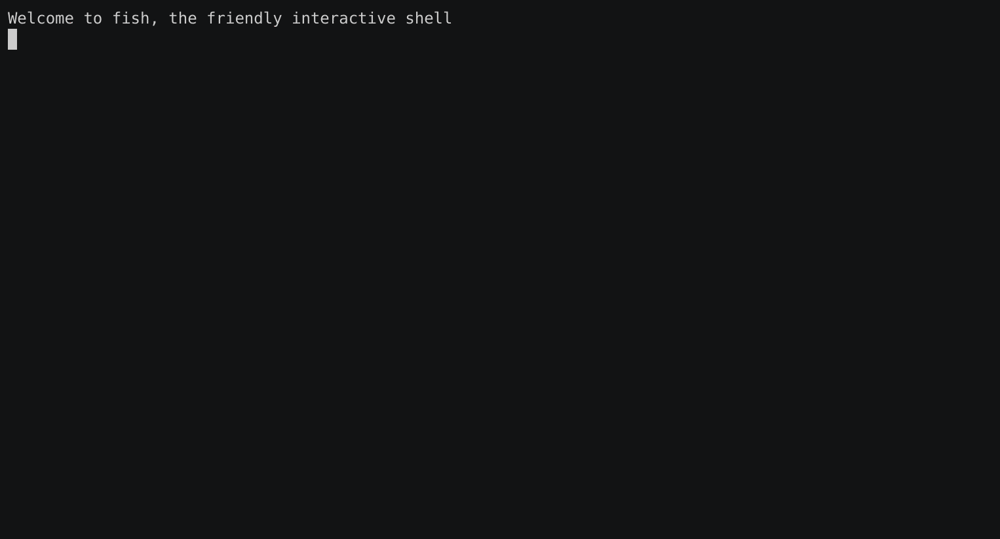
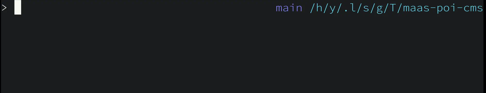
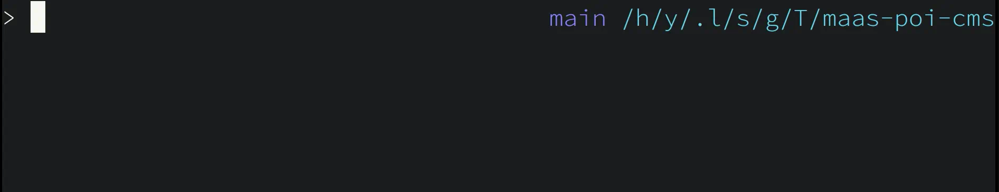

# fish-async-prompt

Make your prompt asynchronous in [Fish](https://fishshell.com/).

## Description



We run your `fish_prompt` and `fish_right_prompt` functions as a separate process to update your prompt asynchronously.

## Installation

With [Fisher](https://github.com/jorgebucaran/fisher):

```
$ fisher install acomagu/fish-async-prompt
```

## Loading Indicator

By default, it prints the previous prompt until the new one is ready. But you can change it to any other string. Define a function which named `<prompt-func-name>_loading_indicator`, like `fish_prompt_loading_indicator`.

For example, to show ` … ` as the indicator of right prompt:

```fish
function fish_right_prompt_loading_indicator
    echo (set_color '#aaa')' … '(set_color normal)
end
```


You can also use the previous prompt string because the function receives it as the first argument. For example, show previous prompt but grayed out:

```fish
function fish_right_prompt_loading_indicator -a last_prompt
    echo -n "$last_prompt" | sed -r 's/\x1B\[[0-9;]*[JKmsu]//g' | read -zl uncolored_last_prompt
    echo -n (set_color brblack)"$uncolored_last_prompt"(set_color normal)
end
```



The loading indicator can be set up not only for `fish_prompt` or `fish_right_prompt`, but also for other function, if you specify it in `async_prompt_functions`. e.g.

```fish
function _git_branch_name
    sleep 1 # For demo.
    git symbolic-ref --short HEAD ^/dev/null
end

function fish_right_prompt
    echo (set_color 88f)(_git_branch_name) (set_color cyan)(prompt_pwd)
end

# Async prompt setup.
set async_prompt_functions _git_branch_name

function _git_branch_name_loading_indicator
    echo (set_color brblack)…(set_color normal)
end
```



## Other Configurations

If you have problems, try changing the values of these variables. **When you change the configurations, please restart your shell.**

### `async_prompt_inherit_variables`

Define variables inherited to prompt functions. Set `all` to pass all global variables.

**Default:** `status pipestatus SHLVL CMD_DURATION fish_bind_mode`

**Example:**

```fish
set -U async_prompt_inherit_variables all
```

### `async_prompt_functions`

Define functions replaced to run asynchronously. Usually one or both of `fish_prompt` and `fish_right_prompt`.

Other functions can be specified, but they must be called from `fish_prompt` or `fish_right_prompt` and function arguments can't be passed to it.

**Default:** `fish_prompt fish_right_prompt`

**Example:**

```fish
set -U async_prompt_functions fish_right_prompt
```

### `async_prompt_internal_signal`

fish-async-prompt uses SIGUSR1 to communicate with the spawned process by default. If it conflicts with other plugin/program, try changing this.

**Default:** `SIGUSR1`

**Example:**

```fish
set -U async_prompt_internal_signal SIGUSR2
```

## Author

- [acomagu](https://github.com/acomagu)

## License

[MIT](LICENSE.md)
